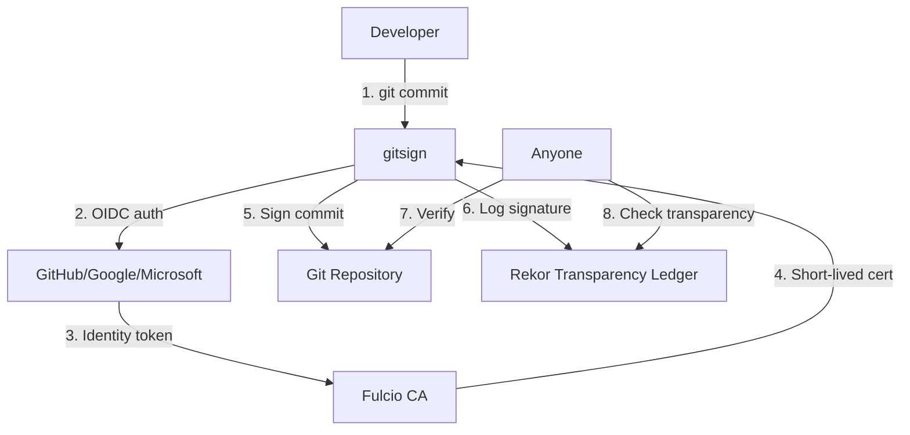

# Cryptographic Verification

## 🔐 Complete Guide to Signed Commits, Tags & Certificate Transparency

This project uses **Sigstore** for cryptographic verification - combining **keyless signing** with **certificate transparency** to provide stronger security than traditional GPG without the complexity of key management.

---

## 🎯 Why Cryptographic Verification Matters

### The Problem: Trust in Software Development

```bash
# Anyone can impersonate any developer
git -c user.name="Maintainer" -c user.email="maintainer@project.com" commit -m "Add backdoor"
```

**Traditional solutions:**
- **GPG signing**: Complex key management, key compromise risk, private verification
- **Trust assumptions**: "This commit came from who it claims"

**Modern solution: Sigstore**
- **Keyless signing**: No long-lived keys to manage or compromise
- **Identity-based**: Tied to your verified GitHub/Google/Microsoft account
- **Certificate transparency**: All signatures publicly auditable
- **Short-lived certificates**: 10-minute validity prevents long-term key compromise

---

## 🏗️ How Sigstore Verification Works

### The Complete Flow



**Step-by-step:**
1. **Developer commits** - `git commit` triggers gitsign
2. **Identity verification** - Browser opens for GitHub/Google/Microsoft login
3. **Certificate issuance** - Fulcio CA issues certificate tied to verified identity
4. **Signing** - Commit signed with ephemeral certificate (valid 10 minutes)
5. **Transparency logging** - Signature automatically logged to public Rekor ledger
6. **Verification** - Anyone can verify signature against public transparency log

### Key Innovation: Certificate Transparency

**Traditional PKI problem:**
```
Developer → Private Key → Signature → Recipient
                ↓
         Single point of failure
         No public accountability
```

**Sigstore solution:**
```
Developer → OIDC Identity → Short-lived Cert → Signature → Public Ledger
                ↓                              ↓            ↓
        Verified identity              Automatic logging  Public audit
```

---

## 🛡️ Security Benefits

### Compared to GPG

| Aspect | GPG | Sigstore |
|--------|-----|----------|
| **Key Management** | Complex, manual | Automatic, keyless |
| **Key Compromise** | Long-term risk | Short-lived (10 min) |
| **Identity Binding** | Self-asserted | OIDC-verified |
| **Transparency** | Optional, private | Automatic, public |
| **Revocation** | Manual CRL | Automatic expiration |
| **Auditability** | Private keyring | Public Rekor ledger |
| **Setup Complexity** | High | Low |

### Threat Model Protection

✅ **Protects Against:**
- **Account compromise** - Signatures logged with timestamp/identity
- **Supply chain attacks** - Public audit trail of all signatures
- **Commit impersonation** - Cryptographic proof of identity
- **Historical tampering** - Immutable transparency log
- **Key compromise** - Short-lived certificates auto-expire
- **Malicious maintainer** - Public visibility of all signing activity

⚠️ **Does Not Protect Against:**
- **Compromised developer machine** (at signing time)
- **OIDC provider compromise** (but monitored & auditable)
- **Fulcio CA compromise** (but logged in Certificate Transparency)

---

## 🔧 Setup for Contributors

### Prerequisites

1. **gitsign installed** (included in our installer)
2. **GitHub account** with verified email
3. **Git configured** with matching email

### Quick Setup

```bash
# Install security controls (includes gitsign)
./install-security-controls.sh

# Verify gitsign is configured
git config --get commit.gpgsign  # Should return: true
git config --get gpg.format      # Should return: x509
git config --get gpg.x509.program # Should return: gitsign
```

### First Signed Commit

```bash
# Make a change
echo "Testing signed commits" >> README.md
git add README.md

# Commit (will trigger browser authentication)
git commit -m "test: verify signing works"

# Browser opens → Login to GitHub → Returns to terminal
# Commit is automatically signed and logged to Rekor
```

### Verification

```bash
# Check your commit signature
git log --show-signature -1

# Expected output:
# gitsign: Signature made using certificate ID 0x...
# gitsign: Good signature from [your-email@example.com]
# Validated Git signature: true
# Validated Rekor entry: true ← Certificate transparency verification
```

---

## 🏷️ Signed Release Tags

### Creating Signed Tags

```bash
# For maintainers creating releases
git tag -s v1.0.0 -m "v1.0.0 - Enhanced Security Release

🔐 Cryptographically signed with Sigstore
🔍 Logged in Rekor transparency ledger
🛡️ Identity verified via GitHub OIDC

Security improvements:
- Enhanced cryptographic verification
- Certificate transparency integration
- Keyless signing implementation

This release is cryptographically signed and publicly auditable."

# Push tag (triggers release automation)
git push --tags
```

### Tag Verification

```bash
# Verify release tag
git tag -v v1.0.0

# Expected output shows both signature AND transparency verification:
# gitsign: Good signature from [maintainer@github.com]
# Validated Git signature: true
# Validated Rekor entry: true
```

---

## 🔍 Certificate Transparency in Practice

### What Gets Logged

Every signature creates a **public, immutable** record in Rekor containing:

```json
{
  "logIndex": 123456789,
  "integratedTime": 1640995200,
  "logID": "c0d23d6ad406973f9559f3ba2d1ca01f84147d8ffc5b8445c224f98b9591801d",
  "body": {
    "spec": {
      "signature": {
        "publicKey": "...",
        "content": "..."
      },
      "data": {
        "identity": "maintainer@example.com",
        "issuer": "https://github.com/login/oauth"
      }
    }
  }
}
```

### Public Verification

**Anyone can verify our signatures:**

```bash
# Search Rekor for our project signatures
rekor-cli search --email maintainer@example.com

# Get specific entry details
rekor-cli get --uuid <entry-uuid>

# Verify entry inclusion in transparency log
rekor-cli verify --uuid <entry-uuid>
```

### Transparency Monitoring

**We actively monitor for suspicious activity:**

```bash
# Example monitoring script (runs every hour)
#!/bin/bash
MAINTAINER="albert@securityronin.com"

# Check for signatures in last hour
RECENT=$(rekor-cli search --email "$MAINTAINER" --since "1 hour ago")

if [ -n "$RECENT" ]; then
    echo "🔔 Signing activity detected: $RECENT"
    # Send alerts to security team
fi
```

**Anomaly detection:**
- ❌ Signatures at unusual hours (3 AM)
- ❌ Volume spikes (50 signatures vs normal 2-5)
- ❌ Unknown email addresses
- ❌ Suspicious commit content

---

## 🚨 Verification for End Users

### Before Using Any Release

**Step 1: Download with checksums**
```bash
curl -O https://github.com/h4x0r/1-click-github-sec/releases/download/v0.4.5/install-security-controls.sh
curl -O https://github.com/h4x0r/1-click-github-sec/releases/download/v0.4.5/checksums.txt
```

**Step 2: Verify file integrity**
```bash
sha256sum -c checksums.txt --ignore-missing
# Expected: install-security-controls.sh: OK
```

**Step 3: Verify cryptographic signatures**
```bash
# Clone repository to verify signatures
git clone https://github.com/h4x0r/1-click-github-sec.git
cd 1-click-github-sec

# Verify the release tag signature
git tag -v v0.4.5

# Expected output:
# gitsign: Good signature from [albert@securityronin.com]
# Validated Git signature: true
# Validated Rekor entry: true
```

**Step 4: Verify against transparency log**
```bash
# Optional: Direct Rekor verification
rekor-cli search --email albert@securityronin.com | grep -C2 "$(git rev-parse v0.4.5)"
```

### Verification Checklist

- [ ] **File checksum verified** (`sha256sum -c checksums.txt`)
- [ ] **Tag signature verified** (`git tag -v v0.4.5`)
- [ ] **Rekor entry confirmed** (shows "Validated Rekor entry: true")
- [ ] **Identity matches expected maintainer** (albert@securityronin.com)
- [ ] **Timestamp reasonable** (not from suspicious time)

---

## 🔧 Advanced Verification

### Programmatic Verification

```python
import requests
import json
from datetime import datetime

def verify_release(tag_name, expected_email):
    """Verify a release against Rekor transparency log"""

    # Search Rekor for signatures by email
    search_url = f"https://rekor.sigstore.dev/api/v1/log/entries"
    params = {"logIndex": "", "email": expected_email}

    response = requests.get(search_url, params=params)
    entries = response.json()

    for entry in entries:
        # Check if entry relates to our tag
        if tag_name in entry.get("body", {}).get("spec", {}).get("data", ""):
            return {
                "verified": True,
                "timestamp": entry.get("integratedTime"),
                "identity": entry.get("body", {}).get("spec", {}).get("identity"),
                "log_index": entry.get("logIndex")
            }

    return {"verified": False, "reason": "No matching entry found"}

# Usage
result = verify_release("v0.4.5", "albert@securityronin.com")
print(f"Verification result: {result}")
```

### Continuous Monitoring

```bash
# Monitor for new signatures (run via cron)
#!/bin/bash
PROJECT_EMAILS=("albert@securityronin.com")
WEBHOOK="https://hooks.slack.com/services/YOUR/SLACK/WEBHOOK"

for email in "${PROJECT_EMAILS[@]}"; do
    # Check for signatures in last 6 hours
    RECENT=$(rekor-cli search --email "$email" --since "6 hours ago" --format json)

    if [ -n "$RECENT" ]; then
        COUNT=$(echo "$RECENT" | jq length)
        MESSAGE="🔔 $COUNT new signatures from $email"

        # Alert via Slack
        curl -X POST -H 'Content-type: application/json' \
             --data "{\"text\":\"$MESSAGE\"}" "$WEBHOOK"
    fi
done
```

---

## 🛠️ Troubleshooting

### Common Issues

**"no signature found"**
```bash
# Check if commit/tag was actually signed
git log --show-signature -1
# If no signature shown, it wasn't signed

# Re-sign if needed (maintainers only)
git commit --amend -S
```

**"certificate verification failed"**
```bash
# Certificate may have expired or identity mismatch
gitsign verify --certificate-identity="expected@email.com" HEAD

# Check Rekor entry status
rekor-cli search --email expected@email.com
```

**"rekor entry not found"**
```bash
# Signature wasn't logged to transparency ledger
# This shouldn't happen with properly configured gitsign

# Check gitsign configuration
git config --get gpg.x509.program  # Should be: gitsign
git config --get gpg.format        # Should be: x509
```

### Getting Help

1. **Check configuration**: `gitsign --help` and verify setup
2. **Review logs**: Look for gitsign error messages during commit
3. **Test signing**: Try signing a test commit to isolate issues
4. **Community support**: Open issue with reproduction steps

---

## 🔗 Additional Resources

- **[Sigstore Documentation](https://docs.sigstore.dev/)** - Complete Sigstore ecosystem guide
- **[gitsign Documentation](https://github.com/sigstore/gitsign)** - Git signing tool details
- **[Rekor Documentation](https://docs.sigstore.dev/rekor/overview/)** - Transparency ledger specifics
- **[Certificate Transparency RFC](https://tools.ietf.org/html/rfc6962)** - Technical specification

---

## 🎯 Key Takeaways

✅ **Sigstore = Signing + Transparency** - They're one integrated security model
✅ **Keyless & automatic** - No GPG key management complexity
✅ **Identity-verified** - Tied to your authenticated GitHub account
✅ **Publicly auditable** - All signatures logged in Rekor transparency ledger
✅ **Short-lived certificates** - 10-minute validity prevents long-term compromise
✅ **Supply chain security** - End-to-end verification from development to deployment

**The bottom line:** Every commit and release in this project is cryptographically signed and publicly verifiable. This provides stronger security than traditional GPG with significantly less complexity.

---

*This comprehensive guide covers both the "how" (signing) and "why" (transparency) of our cryptographic verification system in one complete resource.*