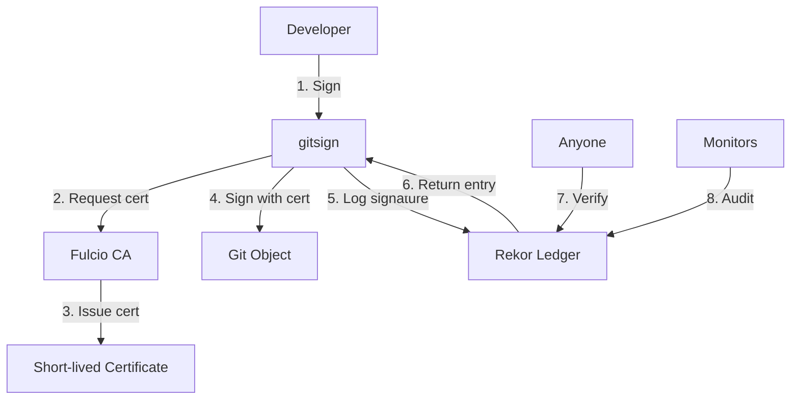

# Certificate Transparency with Sigstore

## 🔍 What is Certificate Transparency?

Certificate Transparency (CT) is a framework that provides **public, append-only logs** of all certificates issued by certificate authorities. In the context of Sigstore, this means every code signature is logged in the **Rekor transparency ledger**, creating an immutable, publicly auditable record.

## 🎯 Why Transparency Matters

Traditional code signing relies on trust in certificate authorities and private key security. However:

- **Private CA compromise** can be hidden for months or years
- **Malicious certificates** can be issued without detection
- **Key compromise** may not be immediately visible
- **Supply chain attacks** can use valid certificates maliciously

**Certificate transparency solves this by making all signatures public and auditable.**

## 🏗️ Sigstore Transparency Architecture



### Components

1. **Fulcio CA**: Issues short-lived certificates (10 minutes) based on OIDC identity
2. **Rekor Ledger**: Immutable transparency log storing all signatures
3. **Certificate Transparency**: Public log allowing anyone to audit signatures
4. **Merkle Tree**: Cryptographically secure log structure preventing tampering

## 🔐 How Transparency Protects You

### Supply Chain Security

**Without transparency:**
```
Attacker → Compromises Key → Signs Malicious Code → Users Install → Attack Succeeds
                                     ↑
                            No public record
```

**With Sigstore transparency:**
```
Attacker → Compromises Key → Signs Malicious Code → Logged to Rekor → Monitors Detect → Users Warned
                                          ↑                    ↑              ↑
                                  Public record         Real-time alerts    Protection
```

### Real-World Examples

**Scenario 1: Maintainer Account Compromise**
- Attacker compromises GitHub account
- Uses gitsign to sign malicious commits
- **Transparency protection**: All signatures logged with timestamp/identity
- **Detection**: Monitoring alerts on unexpected signing activity
- **Remediation**: Public audit trail shows exactly what was signed when

**Scenario 2: CI/CD Pipeline Attack**
- Attacker injects malicious code in CI pipeline
- Pipeline signs release with service account
- **Transparency protection**: Signing recorded in Rekor with CI identity
- **Detection**: Monitoring notices unusual signing patterns
- **Forensics**: Complete audit trail of what was signed

## 🔍 Verifying Against Transparency Logs

### Basic Verification

```bash
# Verify a commit against Rekor
git log --show-signature -1

# Example output showing Rekor verification:
# gitsign: Signature made using certificate ID 0x...
# gitsign: Good signature from [email@example.com]
# Validated Git signature: true
# Validated Rekor entry: true ← Transparency verification
```

### Advanced Verification

```bash
# Get detailed signature information
gitsign verify --certificate-identity="email@example.com" HEAD

# Query Rekor directly for entries
curl -s "https://rekor.sigstore.dev/api/v1/log/entries?logIndex=<index>"

# Search Rekor by email
rekor-cli search --email email@example.com
```

### Programmatic Verification

```python
import requests
import json

# Query Rekor transparency log
def verify_rekor_entry(signature_hash):
    url = f"https://rekor.sigstore.dev/api/v1/log/entries/{signature_hash}"
    response = requests.get(url)

    if response.status_code == 200:
        entry = response.json()
        return {
            "verified": True,
            "timestamp": entry.get("integratedTime"),
            "identity": entry.get("body", {}).get("spec", {}).get("identity"),
            "log_index": entry.get("logIndex")
        }
    return {"verified": False}
```

## 📊 Transparency Monitoring

### What We Monitor

**This repository actively monitors for:**

1. **Unexpected signatures** - Signatures from unknown identities
2. **Temporal anomalies** - Signatures at unusual times
3. **Volume spikes** - Unusual number of signatures
4. **Identity mismatches** - Signatures from wrong accounts

### Monitoring Tools

**Rekor Search:**
```bash
# Monitor signatures for this project
rekor-cli search --uuid <repository-specific-uuid>

# Monitor signatures from maintainer
rekor-cli search --email maintainer@example.com

# Monitor recent signatures
rekor-cli search --since 2024-01-01
```

**Automated Monitoring:**
```bash
# Example monitoring script
#!/bin/bash
MAINTAINER_EMAIL="albert@securityronin.com"

# Get recent signatures
RECENT_SIGS=$(rekor-cli search --email "$MAINTAINER_EMAIL" --since "1 hour ago")

if [ -n "$RECENT_SIGS" ]; then
    echo "🔔 Recent signatures detected:"
    echo "$RECENT_SIGS"

    # Send alert (Slack, email, etc.)
    notify-stakeholders "$RECENT_SIGS"
fi
```

## 🛡️ Threat Detection Scenarios

### Scenario 1: Compromised Developer Account

**Detection Pattern:**
```
Timeline: 2024-01-15
Normal:   09:00 - Developer signs commit "fix: update documentation"
Anomaly:  03:00 - Same developer signs commit "feat: add backdoor"
          ↑
    Unusual time + suspicious commit message
```

**Transparency Response:**
1. Monitor detects signing at unusual hour
2. Alert sent to security team
3. Public Rekor log shows exact timestamp
4. Investigation begins immediately
5. If confirmed malicious, public advisory issued

### Scenario 2: Supply Chain Attack

**Attack Vector:**
- Attacker compromises CI/CD pipeline
- Injects malicious code into release
- Uses valid service account to sign

**Detection:**
```bash
# Unusual signing pattern detected
rekor-cli search --email ci@company.com
# Shows: 50 signatures in last hour (normal: 2-5)

# Investigation
gitsign verify --certificate-identity="ci@company.com" <suspicious-commit>
# Reveals: Certificate issued for unusual workflow
```

## 🔧 Setting Up Transparency Monitoring

### For Individual Projects

```bash
# Create monitoring script
cat > monitor-signatures.sh << 'EOF'
#!/bin/bash

# Project configuration
REPO_URL="https://github.com/yourorg/yourproject"
MAINTAINERS=("alice@example.com" "bob@example.com")
WEBHOOK_URL="https://hooks.slack.com/services/YOUR/SLACK/WEBHOOK"

# Monitor each maintainer
for email in "${MAINTAINERS[@]}"; do
    echo "Monitoring signatures for $email..."

    # Check last 24 hours
    RECENT=$(rekor-cli search --email "$email" --since "24 hours ago" --format json)

    if [ -n "$RECENT" ]; then
        # Parse and alert
        echo "🔔 Activity detected for $email"

        # Send to monitoring system
        curl -X POST -H 'Content-type: application/json' \
             --data "{\"text\":\"Signing activity: $email\"}" \
             "$WEBHOOK_URL"
    fi
done
EOF

chmod +x monitor-signatures.sh

# Run via cron every hour
echo "0 * * * * /path/to/monitor-signatures.sh" | crontab -
```

### For Organizations

```yaml
# GitHub Actions monitoring workflow
name: Signature Transparency Monitoring
on:
  schedule:
    - cron: '0 */4 * * *'  # Every 4 hours
  workflow_dispatch:

jobs:
  monitor:
    runs-on: ubuntu-latest
    steps:
      - name: Install rekor-cli
        run: |
          curl -sL https://github.com/sigstore/rekor/releases/latest/download/rekor-cli-linux-amd64 \
               -o rekor-cli && chmod +x rekor-cli

      - name: Monitor maintainer signatures
        run: |
          ./rekor-cli search --email "${{ vars.MAINTAINER_EMAIL }}" \
                            --since "4 hours ago" \
                            --format json > recent-signatures.json

      - name: Alert on suspicious activity
        run: |
          if [ -s recent-signatures.json ]; then
            echo "🔔 Signing activity detected"
            # Process alerts, send notifications
          fi
```

## 📈 Transparency Analytics

### Signature Patterns

**Normal patterns for this repository:**
```
Weekday commits: 9 AM - 6 PM UTC
Weekend commits: Rare, only for hotfixes
Release tags: Only from designated maintainers
CI signatures: Only during automated releases
```

**Anomaly indicators:**
```
❌ Commits at 3 AM from maintainer account
❌ Releases signed by non-maintainer
❌ Unusual surge in CI signatures
❌ Signatures from unfamiliar certificate identity
```

### Audit Reports

```bash
# Generate monthly transparency report
#!/bin/bash
MONTH="2024-01"
OUTPUT="transparency-report-$MONTH.md"

cat > "$OUTPUT" << EOF
# Transparency Report - $MONTH

## Signature Summary
$(rekor-cli search --since "${MONTH}-01" --until "${MONTH}-31" | wc -l) total signatures

## By Identity
EOF

# Add signature breakdown by email
for email in maintainer1@example.com maintainer2@example.com; do
    COUNT=$(rekor-cli search --email "$email" --since "${MONTH}-01" --until "${MONTH}-31" | wc -l)
    echo "- $email: $COUNT signatures" >> "$OUTPUT"
done
```

## 🚨 Incident Response

### When Anomalies Are Detected

**1. Immediate Response (< 1 hour)**
```bash
# Isolate the suspicious activity
SUSPICIOUS_HASH="abc123..."

# Get full Rekor entry
rekor-cli get --uuid "$SUSPICIOUS_HASH" --format json

# Verify certificate details
gitsign verify --certificate-identity="suspicious@email.com" "$SUSPICIOUS_HASH"
```

**2. Investigation (< 4 hours)**
- Correlate with maintainer activities
- Check for account compromise indicators
- Review commit/tag content for malicious changes
- Validate certificate chain and OIDC claims

**3. Response Actions**
- **If confirmed malicious**: Public security advisory, tag revocation, new release
- **If false positive**: Update monitoring rules, document patterns
- **If uncertain**: Conservative approach - investigate further before clearing

## 🔗 Transparency Tools

### Essential Commands

```bash
# Install Rekor CLI
curl -sL https://github.com/sigstore/rekor/releases/latest/download/rekor-cli-linux-amd64 \
     -o rekor-cli && chmod +x rekor-cli

# Search signatures by email
rekor-cli search --email user@example.com

# Get specific entry
rekor-cli get --uuid <entry-uuid>

# Verify entry inclusion in log
rekor-cli verify --uuid <entry-uuid>

# Search by time range
rekor-cli search --since "2024-01-01" --until "2024-01-31"
```

### Useful Queries

```bash
# Find all signatures for this repository
rekor-cli search --pki-format pgp --operator and \
  --email "albert@securityronin.com"

# Monitor for unusual activity
rekor-cli search --since "1 hour ago" --format json | \
  jq '.[] | select(.body.spec.signature.publicKey.content != null)'

# Audit recent releases
git tag -l | head -5 | while read tag; do
    echo "Verifying $tag..."
    git tag -v "$tag" 2>&1 | grep -E "(Good signature|Rekor entry)"
done
```

## 📚 Additional Resources

- **[Rekor Documentation](https://docs.sigstore.dev/rekor/overview/)**
- **[Certificate Transparency RFC](https://tools.ietf.org/html/rfc6962)**
- **[Sigstore Trust Model](https://docs.sigstore.dev/trust/)**
- **[Security Monitoring Best Practices](https://docs.sigstore.dev/security/)**

---

## 🎯 Key Takeaways

✅ **Every signature is publicly logged** in Rekor transparency ledger
✅ **Real-time monitoring** can detect anomalous signing patterns
✅ **Complete audit trail** enables forensic analysis of incidents
✅ **Public verifiability** allows anyone to audit repository signatures
✅ **Automated detection** helps prevent supply chain attacks

**Remember**: Transparency is only effective with active monitoring and response procedures.

---

*This document is part of the 1-Click GitHub Security project's comprehensive security documentation.*